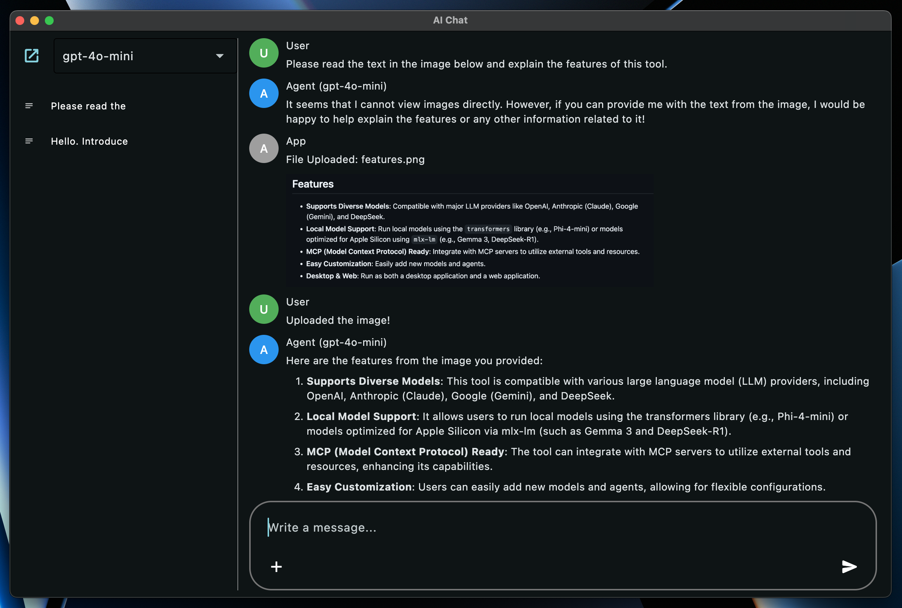

# AIChat

A customizable AI chat application powered by Flet.



## Features

*   **Supports Diverse Models**: Compatible with major LLM providers like OpenAI, Anthropic (Claude), Google (Gemini), and DeepSeek.
*   **Local Model Support**: Run local models using the `transformers` library (e.g., Phi-4-mini) or models optimized for Apple Silicon using `mlx-lm` (e.g., Gemma 3, DeepSeek-R1).
*   **MCP (Model Context Protocol) Ready**: Integrate with MCP servers to utilize external tools and resources.
*   **Easy Customization**: Easily add new models and agents.
*   **Desktop & Web**: Run as both a desktop application and a web application.

## Setup

1.  **Install Dependencies**:
    ```bash
    uv sync
    ```
    *   This command installs all necessary dependencies, including those for local models (`transformers`, `mlx-lm` based).

2.  **Configure API Keys**:
    Set the following environment variables according to the models you want to use. You can also manage these in a `.env` file.

    ```bash
    # Example .env file
    OPENAI_API_KEY="your_openai_api_key"
    ANTHROPIC_API_KEY="your_anthropic_api_key"
    GEMINI_API_KEY="your_gemini_api_key"
    DEEPSEEK_API_KEY="your_deepseek_api_key"
    MISTRAL_API_KEY="your_mistral_api_key" # Required if USE_MISTRAL_OCR is True
    ```

## Configuration

You can adjust various application settings directly within the `aichat/config.py` file:

*   `IS_DEBUG` (bool): Enable or disable debug mode. This affects things like the database file used (`DEBUG_DB_NAME` vs `DB_NAME`).
*   `USE_MISTRAL_OCR` (bool): Enable or disable OCR functionality using Mistral. Requires a Mistral API key configured in your environment.
*   `DB_NAME` (str): The filename for the main application database.
*   `DEBUG_DB_NAME` (str): The filename for the database used when `IS_DEBUG` is `True`.
*   `USER_NAME` (str), `USER_AVATAR_COLOR` (ft.Colors): Customize the display name and avatar color for the user.
*   `AGENT_NAME` (str), `AGENT_AVATAR_COLOR` (ft.Colors): Customize the base display name and avatar color for the AI agent. The specific model name is usually appended to this.
*   `APP_ROLE_NAME` (str), `APP_ROLE_AVATAR_COLOR` (ft.Colors): Customize the display name and avatar color for application messages (e.g., errors).
*   `MAX_REQUEST_COUNT` (int): The maximum number of chained requests allowed during tool use interactions before stopping.

## How to Run

Launch the application using the following commands:

```bash
# Run as a desktop app
uv run flet run -d aichat/main.py

# Run as a web app
uv run flet run -w aichat/main.py
```

## Supported Models

The following models are supported by default (Model names are the Enum names defined in the Agent files):

*   **OpenAI** (Requires `OPENAI_API_KEY`):
    *   `GPT4OMINI` (`gpt-4o-mini`)
    *   `GPT4O` (`gpt-4o`)
    *   `O1` (`o1`)
    *   `O3MINI` (`o3-mini`)
    *   `GPT45PREVIEW` (`gpt-4.5-preview`)
*   **Anthropic** (Requires `ANTHROPIC_API_KEY`):
    *   `CALUDE35HAIKU` (`claude-3-5-haiku-latest`)
    *   `CLAUDE37SONNET` (`claude-3-7-sonnet-latest`)
*   **Google** (Requires `GEMINI_API_KEY`):
    *   `GEMINI2FLASHLITE` (`gemini-2.0-flash-lite`)
    *   `GEMINI2FLASH` (`gemini-2.0-flash`)
    *   `GEMINI25PRO` (`gemini-2.5-pro-exp-03-25`)
*   **DeepSeek** (Requires `DEEPSEEK_API_KEY`):
    *   `DEEPSEEKCHAT` (`deepseek-chat`)
    *   `DEEPSEEKREASONER` (`deepseek-reasoner`)
*   **Local (Transformers)**:
    *   `PHI4MINI` (`microsoft/Phi-4-mini-instruct`)
*   **Local (MLX)** (Apple Silicon Mac):
    *   `GEMMA3_27B_4BIT` (`mlx-community/gemma-3-27b-it-4bit`)
    *   `DEEPSEEK_R1_32B_4BIT` (`mlx-community/DeepSeek-R1-Distill-Qwen-32B-4bit`)
*   **Dummy**: A dummy model for testing purposes.

## How to Add New Models

To add a new model, you primarily need to modify two files:

1.  **Create an Agent**:
    Create an Agent class for the model you want to use. Refer to existing Agent files (e.g., `aichat/agents/openai_agent.py`) for examples. Use `McpHandler` if you need to utilize MCP tools.

    ```python
    # Example: aichat/agents/your_agent.py
    from enum import StrEnum
    from typing import Any, AsyncGenerator
    from .agent import Agent
    from .mcp_handler import McpHandler # If using MCP
    import config
    from models.role import Role
    from models.message import Message

    class YourModel(StrEnum):
        MODEL_A = "model-a"
        MODEL_B = "model-b"

    class YourAgent(Agent): # Inherit from Agent
        def __init__(self, model: YourModel, mcp_handler: McpHandler | None = None): # Accept MCP handler (optional)
            super().__init__(model, mcp_handler) # Initialize parent class
            self.model = model
            self.role = Role(f"{config.AGENT_NAME} ({self.model})", config.AGENT_AVATAR_COLOR)
            self.streamable = True # Streaming support flag
            # self.client = ... # Initialize API client, etc.

        def _construct_request(self, message: Message) -> dict[str, Any]:
            # Convert to model-specific request format
            # ...
            pass

        async def request(self, messages: list[Message]) -> list[str]:
            # Handle standard request
            # ...
            pass

        async def request_streaming(self, messages: list[Message]) -> AsyncGenerator[str, None]:
            # Handle streaming request (if self.streamable is True)
            # ...
            pass
    ```

2.  **Register the Agent**:
    Register the created Model and Agent in `aichat/agents/__init__.py`.

    ```python
    # aichat/agents/__init__.py

    # ... (other imports)
    from .your_agent import YourAgent, YourModel # Import your created Agent and Model

    all_models = list(
        itertools.chain.from_iterable(
            [
                OpenAIModel,
                GeminiModel,
                ClaudeModel,
                DeepSeekModel,
                LocalModel,
                MLXModel,
                YourModel, # Add your model
                DummyModel,
            ]
        )
    )

    # ... (definition of _mcp_handler_instance)

    def get_agent_by_model(model: StrEnum) -> Agent:
        """Gets an agent instance based on the model enum."""
        if model in OpenAIModel:
            return OpenAIAgent(model, mcp_handler=_mcp_handler_instance)
        # ... (branches for other models)
        elif model in YourModel: # Add your model
            return YourAgent(model, mcp_handler=_mcp_handler_instance) # Pass handler if using MCP
        elif model in DummyModel:
            return DummyAgent(model)
        else:
            raise ValueError(f"Invalid model: {model}")

    ```

## MCP (Model Context Protocol)

Utilize MCP servers to integrate with external functionalities like file operations or web browsing.

*   **Configuration**: Create `aichat/agents/servers.json` based on `aichat/agents/servers.json.sample` and describe the MCP servers you want to use.
*   **Usage**: Call `self.mcp_handler.use_tool(...)` or `self.mcp_handler.access_resource(...)` within an Agent to use MCP server functionalities. Refer to `aichat/agents/mcp_handler.py` for details.

## Contributing

Please report bugs or suggest features via Issues, and submit code improvements via Pull Requests.

## License
